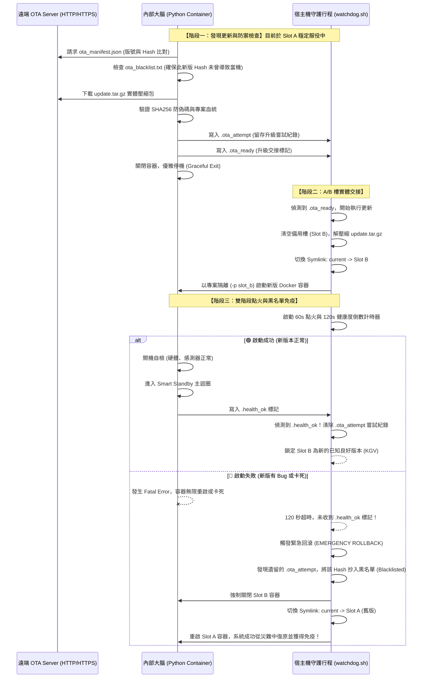

# __PROJECT_NAME__

Raspberry Pi IoT Core Standardization Template Project.

## 📑 目錄 (Table of Contents)
- [🛠️ Hardware Note](#️-hardware-note)
- [💻 Programming Environment](#-programming-environment)
- [🚀 1. 容器執行、測試與關閉指南](#-1-容器執行測試與關閉指南)
- [📐 2. 程式架構說明](#-2-程式架構說明)
- [📊 3. 狀態機與主迴圈運作機制](#-3-狀態機與主迴圈運作機制)
- [🛡️ 4. 工業級無人值守 OTA 與 A/B 槽架構](#-4-工業級無人值守-ota-與-ab-槽架構)
- [📦 5. 韌體編譯與打包發布指南](#-5-韌體編譯與打包發布指南)
- [🔔 6. 通用 Webhook 即時告警與通知機制](#-6-通用-webhook-即時告警與通知機制)
- [💾 7. 工業級防斷電原子檔案持久化機制](#-7-工業級防斷電原子檔案持久化機制)
- [🗄️ 8. SQLite 本地資料庫持久層 (預留規劃)](#️-8-sqlite-本地資料庫持久層-預留規劃)
- [☁️ 9. MQTT 雲端物聯網通訊 (預留規劃)](#️-9-mqtt-雲端物聯網通訊-預留規劃)

---

## 🛠️ Hardware Note
* **Host Platform**: Raspberry Pi 5 / Raspberry Pi Zero 2 W
* **Peripherals**: GPIO LEDs, Relay / Electronic Lock Control, Status Pins.

## 💻 Programming Environment
* **Python Version**: `3.11.x`
* **Base OS**: Debian 12 Bookworm Slim (`python:3.11-slim-bookworm` Docker Containerized)

### Core Packages
| Rank | Package Name      | Version  | Description |
|-----:|-------------------|----------|-------------|
|   1  | pydantic-settings | Latest   | 嚴格的全域組態防護與型態驗證 (Strict config validation) |
|   2  | smbus2            | Latest   | I2C 匯流排通訊 (VL53L0X 雷射測距儀底層驅動) |
|   3  | pyserial          | Latest   | UART 序列埠通訊 (Barcode 條碼掃描器通訊) |
|   4  | rpi-lgpio         | Latest   | 樹莓派 5 專用硬體 GPIO 控制底層核心 |
|   5  | gpiozero          | Latest   | 高階 GPIO 控制封裝 (完美相容 rpi-lgpio 核心) |
|   6  | paho-mqtt         | Latest   | MQTT 物聯網通訊客戶端 (雲端通訊藍圖保留) |
|   7  | fastapi           | Latest   | 高效能非同步 API 框架 (未來 WebUI 藍圖保留) |
|   8  | uvicorn           | Latest   | ASGI 輕量級網頁伺服器 (供 FastAPI 運行使用) |
|   9  | cryptography      | Latest   | 加密模組 (用於 MQTT SSL/TLS 安全連線與認證) |

---
## 🚀 1. 容器執行、測試與關閉指南

本專案採用「一個 Dockerfile + 雙環境 Compose 藍圖」設計，完美支援 **PC(WSL2)** 本地模擬除錯與 **樹莓派實機(PI)** 生產上線。

### 🐋 Docker 安裝

```bash
curl -sSL https://get.docker.com | sh
```

### 💻 A. PC (WSL2 / Windows) 開發環境

開發環境預設開啟 `MOCK_HARDWARE=true` 模擬器環境變數，不掛載實體硬體節點。

> **💡 提示：** 系統預設不需要 `.env` 即可在開發環境啟動。若您需要自訂 `OTA_SERVER_URL` 等環境變數，請複製專案內的 `.env.sample` 並重新命名為 `.env` 即可自動生效。

* **執行與編編譯：**
  ```bash
  docker compose -f docker-compose.dev.yml up --build
  ```

* **關閉與釋放資源：**

  ```bash
  docker compose -f docker-compose.dev.yml down
  ```

* **清除開發暫存檔 (Clean Workspace)：**

  當您完成測試，或是想要清除打包的輸出檔 (`output/`)、Python 快取 (`__pycache__`) 與模擬觸發文字檔時，可隨時執行此專屬腳本保持環境純淨：

  ```bash
  sudo ./tools/clean.sh
  ```

* **動態模擬測試（File-Driven Simulation）：**

  保持第一個容器視窗開啟，開啟第二個終端機視窗，依序輸入以下指令即可對核心大腦下達模擬動作：

  #### 🧪 測試情境一：

  1. Test_1.1：
      ```bash
      echo "Test_1.1"
      ```

  #### 🧪 測試情境二：

  1. Test_2.1：
      ```bash
      echo "Test_2.1"
      ```

  #### 🧪 測試情境三：

  1. Test_3.1：
      ```bash
      echo "Test_3.1"
      ```

### 🍓 B. Raspberry Pi 5 實機生產環境

實機生產環境採用**工業級 A/B 槽 (A/B Slot) 架構**與 **Systemd 看門狗守護行程 (Watchdog)** 管理。系統會自動關閉 Mock 模擬，並直接掛載樹莓派實體的 GPIO、I2C 匯流排與硬體串口（UART）。

> **💡 提示：** 首次安裝啟動時，看門狗會自動探測硬體型號並採集 CPU 指紋，於護城河中自動生成 `/opt/__PROJ_NAME_LOWER__/data/.env` 持久化環境變數檔。您可於安裝後修改此檔案來變更 `OTA_SERVER_URL` 等機密設定。

* **🚀 出廠與現場安裝 (一鍵部署)：**

  生產環境嚴禁手動下達 `docker compose` 指令。請直接使用專屬安裝腳本，支援原始碼或 Tarball 壓縮包一鍵直裝：
  ```bash
  # 方式一：(推薦) 將 install.sh 與打包好的 install.tar.gz 放在同目錄下直接執行
  sudo ./install.sh

  # 方式二：在開發專案的原始碼目錄下執行
  sudo ./tools/install.sh
  ```

* **🔍 即時日誌與狀態監控：**

  ```bash
  # 1. 監控外層看門狗 (A/B 槽切換、健康度倒數 120s、硬體指紋生成)
  sudo journalctl -u __PROJ_NAME_LOWER__.service -f
  
  # 2. 監控內層 Python 大腦 (請先用 sudo docker ps 確認當前運行的是   slot_a 還是 slot_b)
  sudo docker logs -f slot_a-app-1
  
  # 3. 查閱持久化歷史日誌檔 (不受容器重啟影響，具備容量滾動防爆機制)
  tail -f /opt/__PROJ_NAME_LOWER__/data/logs/__PROJ_NAME_LOWER___runtime.log
  ```

* **🛑 服務控制與安全重啟：**

  請透過 Linux 系統原生的 `systemd` 進行管理，看門狗會自動代理並安全地處理底層 Docker 容器的啟停：

  ```bash
  sudo systemctl status __PROJ_NAME_LOWER__   # 查看看門狗服務狀態
  sudo systemctl restart __PROJ_NAME_LOWER__  # 套用新的 .env 設定並安全重啟系統
  sudo systemctl stop __PROJ_NAME_LOWER__     # 暫停服務
  ```

* **🗑️ 優雅卸載與資源釋放：**

  若需徹底清除系統（包含 SQLite 資料庫、歷史日誌、A/B 槽與背景容器），請執行專屬無痕卸載腳本，切勿手動刪除資料夾以防產生殭屍孤兒容器：

  ```bash
  sudo /opt/__PROJ_NAME_LOWER__/current/tools/uninstall.sh
  ```

## 📐 2. 程式架構開發說明

本專案嚴格落實乾淨架構（Clean Architecture）與依賴反轉原則（Dependency Inversion Principle），並達成 **「100% 零 OS 依賴的純淨大腦」**。整體專案的頂層分層結構如下：

```text
__PROJECT_NAME__/
├── app/                          # 【🧠 應用程式核心大腦】
│   ├── config.py                 # 🛡️ 全域組態防護網 (Pydantic Settings 變數收口)
│   ├── main.py                   # 組合根 (Composition Root) 與多環境動態依賴注入
│   │
│   ├── common/                   # 【通用工具層】純函數與持久化工具
│   │   ├── persistence.py        # 💾 原子性防斷電檔案寫入工具 (AtomicFileStorage)
│   │   └── utils.py              # 🛠️ 通用數據解析與輔助工具
│   │
│   ├── config/                   # 硬體參數與組態設定檔 (.cfg)
│   │   ├── core/core.cfg         # FSM 狀態機核心時間與週期配置
│   │   ├── gpio/gpio.cfg         # GPIO 引腳定義及控制語意
│   │   ├── logging/logging.cfg   # ISO 8601 UTC 與容量滾動日誌配置
│   │   ├── mock/mock.cfg         # 混合模擬獨立開關設定檔
│   │   ├── storage/storage.cfg   # 持久化檔案路徑配置檔
│   │   └── webhook/discord.cfg   # Webhook 通知與告警參數設定檔
│   │
│   ├── core/                     # 🔥 核心業務層 (FSM 狀態機，完全隔離底層基礎設施)
│   │   ├── hardware.py           # 有限狀態機（FSM）業務行為控制邏輯核心
│   │   └── interfaces.py         # 抽象硬體合約與工控語意狀態枚舉（Enums）定義
│   │
│   ├── database/                 # (TBD)【💾 資料持久層】預留本地 SQLite 連線池與 CRUD 操作
│   │
│   └── infrastructure/           # 🔌 基礎設施層 (實體驅動、Mock 模擬、日誌、OTA 下載器)
│       ├── gpio/                 # 實體 GPIO 輸入輸出控制器驅動
│       ├── logging/              # 多命名空間 ISO 8601 UTC 滾動日誌實作
│       ├── mock/                 # WSL/PC 開發環境專用之虛擬代理
│       ├── mqtt/                 # (TBD) MQTT 雲端物聯網通訊客戶端
│       ├── ota/                  # OTA 升級代理大腦與多協定下載器
│       └── webhook/              # Discord Webhook HTTP POST 原生傳輸適配器
│
├── tests/                        # 【🧪 自動化測試層】獨立單元測試腳本
├── tools/                        # 【🛠️ 部署與維運工具】編譯打包、A/B 槽安裝卸載、清理與 Watchdog 腳本
├── data/                         # 【🏰 實體數據護城河】SQLite 資料庫、環境變數與持久化數據檔案
├── docker-compose.*.yml          # 雙環境 Docker 佈署藍圖 (dev / pi)
├── Dockerfile                    # 多階段極輕量化映像檔編譯藍圖
└── version.json                  # 全域版本號與 Commit 資訊模板
```

### 🛠️ 開發擴充規範

1. 全域組態收口 (Global Configuration Centralization)：

    * 嚴格禁止在程式中任何地方（包含 `main.py`）呼叫 `os.environ` 讀取作業系統變數。
    * 所有的環境變數（如 `OTA_SERVER_URL`、`DEVICE_ID`）、模擬開關與硬體引腳，必須統一收口於 `app/config.py` 的 Pydantic 模型中。透過強型別宣告（如 `bool`, `int`），達成開機瞬間的自動型態轉換與防呆熔斷。

2. 參數物件化：

    * 硬體與配置解耦：所有新增的硬體參數，必須先在 `app/config/` 下建立對應的 `.cfg`，並在 `app/config.py` 的模型中宣告型態。驅動類別不允許直接 read 設定檔，必須由外部在初始化時將參數傳入。
    * 所有涉及有限狀態機跳轉的核心控制參數（如投遞超時、關門限時、條碼與主迴圈睡眠週期、測距與淨空門檻）必須全數封裝於 `app/config/core/core.cfg` 之中。
    * 核心大腦 `SmartCoreManager` 的建構子嚴格禁止宣告鬆散零碎的常數參數，必須統一透過 `CoreFsmParams` 資料類別（Dataclass）進行物件化接收。組合根會利用字典推導式，將全域常數精準映射給核心狀態機，達成零修改擴展。

3. 面向介面合約與工控枚舉：

    * 核心業務大腦嚴格禁止直接引入任何基礎設施、第三方通訊庫或硬體驅動暫存器。若要操縱外部設備，必須先在 `app/core/interfaces.py` 中建立對應的抽象介面合約（如 `ILogger`, `IOtaAgent`）。
    * 程式碼內部禁止硬編碼 `0` 與 `1` 等缺乏語意的二進位數值，必須全面採用 `PinState`（電平高低）、`LockCtrl`（上鎖解鎖）與 `GateStatus`（閘門閉合與打開）等嚴謹定義的工控語意枚舉（Enum），確保極高的代碼可讀性與可維護性。

4. 隨插即用的混合模擬 (Hybrid Mocking Architecture)：

    * 當處於無實體硬體的 WSL 開發環境，或實體機的某個感測器損壞時，可透過 `app/config/mock/mock.cfg` 對單一硬體進行「局部模擬」。
    * 組合根（`main.py`）負責攔截硬體初始化錯誤，並能在硬體嚴重損壞時，動態注入全套虛擬驅動 (`mock_drivers.py`)，引導核心進入「閃紅燈死鎖」狀態，確保外層 Watchdog 能精準判定並觸發 A/B 槽回滾。

5. 全域日誌標準化 (Unified Logging Policy)：

    * 嚴格禁止使用 `print()`。無論是基礎設施層（如下載器錯誤、模擬硬體狀態變更）還是核心大腦，所有輸出皆須呼叫注入的 `ILogger` 介面。
    * 日誌輸出將自動帶有 ISO 8601 UTC 時間戳記與層級命名空間，並支援容量滾動熔斷（Rotating File），確保 IoT 設備長期運行的儲存空間安全。


## 📊 3. 狀態機流程圖 (State Machine Flow)

智慧回收箱核心大腦（`SmartCoreManager`）的控制週期採用嚴謹的非阻塞有限狀態機（FSM）架構。除了具備完善的硬體自檢與防呆熔斷安全網之外，更深度整合了 **A/B 槽交接與黑名單免疫機制**；能在遭遇致命硬體損壞或升級卡死時，主動引導外層 Watchdog 進行安全回滾，達成真正的無人值守目標。

### 🛠️ 3.1 開機硬體連鎖自檢 (Boot Hardware Self-test)

1. **點火與連鎖自檢**：開機優先寫入 `.boot_ok` 標記，接著進行系統時間（NTP >= 2026）與硬體引腳狀態檢查。

2. **故障死鎖與安全回滾**：自檢失敗時進入閃紅燈死鎖狀態，阻斷 .`health_ok` 產生，引導外層 Watchdog 於 120 秒後啟動 A/B 槽回滾。

3. **開機跑馬燈與 OTA 檢查**：通過自檢後觸發跑馬燈，並發起遠端 OTA 升級檢查。

4. **常態待機主迴圈**：進入主迴圈週期（`LOOP_MAIN_SLEEP_SEC`），維持系統穩定運行。

### 🔁 3.2 生命週期狀態流向圖 (Lifecycle Flowchart)

`TODO`

### 🔄 3.3 狀態轉移矩陣 (State Transition Table)

`TODO`

### 💡 3.4 燈號狀態判定 (LED Indicators)

`TODO`

<a id="ota-architecture"></a>
## 🛡️ 4. 工業級無人值守 OTA 與 A/B 槽架構 (Industrial OTA & A/B Slot)

為了確保部署在戶外的邊緣物聯網設備（Edge IoT）具備極高的可用性與容錯能力，本專案導入了工業級的 `A/B 槽 (Slot) 雙系統架構` 與 `OTA (Over-The-Air) 遠端升級機制`。透過底層的 Systemd 守護行程 (`watchdog.sh`) 與上層的 Python 核心代理 (`OtaAgent`) 協同運作，達成升級失敗時的「自動回滾」與「黑名單免疫」，確保設備永不卡死。

### 📦 4.1 出廠安裝與優雅卸載 (Install & Uninstall)

系統摒棄了將檔案四處散落的傳統做法，改採高度集中的護城河式目錄結構，並配備智慧化的部署工具：

* **智慧安裝 (`install.sh`)：**

    具備智慧路徑解析能力，支援一鍵直裝。以 `sudo` 權限執行後，腳本會自動建立 `/opt/__PROJ_NAME_LOWER__` 目錄，並在內部劃分 `slot_A` 與 `slot_B`。接著會自動尋找同目錄下的 `install.tar.gz` 解壓縮至 Slot A，建立 `current` 軟連結，並將 `tools/watchdog.sh` 獨立抽離至根目錄後，註冊為 Linux Systemd 開機自啟動服務。

* **無痕卸載 (`uninstall.sh`)：**

    具備裝甲級的清理能力。腳本會精準加上 `-p $SLOT_NAME` 專案隔離參數，將背景執行的 A/B 槽 Docker 容器與孤兒網路徹底優雅關閉 (`down -v`)，接著解除 Systemd 註冊，最後將 `/opt/__PROJ_NAME_LOWER__` 整包徹底刪除，絕不殘留任何殭屍行程。

### 🐕 4.2 Watchdog 宿主機守護行程

部署於系統底層的 `watchdog.sh` 掌握了設備的生殺大權，具備以下四大核心防禦職責：

1. **首次開機探測 (First Boot Initialization)：**

    當機台首次通電，Watchdog 會自動探測硬體型號（如 Raspberry Pi 5），並讀取 CPU Serial 或 MAC Address 生成唯一的設備指紋（`DEVICE_ID`），寫入持久化的 `/opt/__PROJ_NAME_LOWER__/data/.env` 供 Docker 全域注入讀取。

2. **Docker 專案實體隔離 (Cache Isolation)：**

    Watchdog 在喚醒容器時，會強制帶入 `-p $SLOT_NAME`（例如 `-p slot_a`）。這不僅徹底解決了 A/B 槽 Image 構建時的快取交叉污染問題，更能百分之百發揮 Docker 分層快取的威力，讓升級或重啟的啟動時間壓縮至不到 2 秒！

3. **雙階段連鎖健康檢測 (Two-Stage Health Check)：**

    * **階段一（60 秒點火）**：等待 Python 容器啟動並寫入 `.boot_ok`，防範語法錯誤、環境噴掉或 Docker 引擎卡死。
    * **階段二（120 秒上線）**：等待核心大腦完成硬體 I2C/UART 檢測與初始邏輯。唯有百分之百通過自檢並寫入 `.health_ok`，Watchdog 才會將該槽位鎖定為「已知良好版本 (KGV)」。

4. **緊急回滾與黑名單免疫 (Rollback & Blacklist System)：**

    若容器在 120 秒內意外暴斃，且未留下 `.ota_ready` 升級交接標記，Watchdog 將立刻摧毀當前容器，將 `current` 軟連結切換回舊版槽位以恢復服務。

    **🔥 黑名單制裁：** 若回滾時發現數據護城河中有未清除的 `.ota_attempt` 紀錄，代表剛才死掉的是最新下載的韌體。Watchdog 會當場將該版本的 Hash 抄寫入 `ota_blacklist.txt`，賦予系統永久免疫力，徹底終結「無限當機更新迴圈」。

### 🔄 4.3 A/B 槽無縫交接與 OTA 升級流程
系統升級採用 **「Python 下載驗證 ➡️ Watchdog 負責切換」** 的雙盲交接機制。這確保了下載過程中就算斷電，也不會損壞正在運行的舊系統；而新版若帶有致命 Bug，系統也能透過留存的嘗試紀錄產生「永久免疫」，達成真正的無人值守目標：


## 📦 5. 韌體編譯與打包發布指南 (Firmware Build & Release Guide)

本專案具備高度自動化的出廠包與 OTA 升級包編譯機制。打包腳本會自動讀取 `version.json` 模板，動態注入當前的 Git Commit Hash 與 UTC 編譯時間，並將產出物統一集中至 `output/` 目錄。

> **⚠️ 前置要求：** 執行打包腳本前，請確保您的開發環境已安裝 Git 且專案處於 Git 儲存庫中，否則 Commit Hash 將顯示為 `UNKNOWN_HASH`。

### 📌 5.1 修改版本號 (Version Bump)

在準備發布新版前，請先修改專案根目錄的 `version.json` 中的 `version` 欄位（請勿修改 `commit_hash` 與 `build_date`，腳本會自動覆寫）。

```json
{
  "project_name": "__PROJECT_NAME__",
  "flavor": "iot_client",
  "version": "v1.0.0",
  "commit_hash": "DEV_LOCAL",
  "build_date": "DEV_LOCAL"
}
```

### 🏭 5.2 產出出廠直裝包 (Factory Install Package)

適用於全新 SD 卡出廠，或是設備發生毀滅性損毀需要全機重灌的情境。
此包會包含所有的 `tools/` 腳本（如 `watchdog.sh`, `install.sh`）。

```bash
# 在專案根目錄下執行：
python3 tools/build_install.py
```

### 🚀 5.3 產出 OTA 遠端升級包 (OTA Update Package)

適用於透過 HTTP/HTTPS 下發給已經在戶外運作的機台。
為確保安全與減小體積，此打包過程會自動排除 `tools/` 目錄，並生成附帶 SHA256 防偽驗證碼的對接清單。

```bash
# 在專案根目錄下執行：
python3 tools/build_update.py
```

#### 產出物：

> **💡 提示：** 請將這兩個檔案一起上傳至您在 `.env` 中設定的 `OTA_SERVER_URL` 網址根目錄下即可。

1. `output/update.tar.gz` (實體更新包)
2. `output/ota_manifest.json` (提供給雲端伺服器或 Nginx 的更新驗證清單)

## 🔔 6. 通用 Webhook 即時告警與通知機制

本系統內建輕量化非阻塞 Webhook 通知模組，遵循乾淨架構（Clean Architecture）設計。核心狀態機僅依賴抽象介面 `IWebhookAgent`，實體傳輸層 `DiscordWebhookClient` 使用 Python 原生 `urllib` 模組透過 HTTP POST 進行非阻塞發射，達成零外部套件依賴與高可靠度推播。
> **💡 提示：** 當前只支援 `Discord`

## 💾 7. 工業級防斷電原子檔案持久化機制

為確保設備在戶外遭遇突發斷電、異常重啟或 Docker 容器重構時不丟失核心業務狀態，系統於 `app/common/persistence.py` 實作了具備 ACID 原子特性的 `AtomicFileStorage` 模組，並透過 `/workspace/data/` 實體護城河目錄完成資料持久化。

### 7.1 原子寫入與 POSIX 強制沖刷原理

傳統檔案寫入（如 `open(..., 'w')`）在將資料寫入磁碟的過程中，若遭遇突發斷電，極易導致檔案內容破損或產生 0 Byte 壞檔。本系統採用 POSIX 標準之二階段原子替換機制：

1. **暫存寫入**：優先將資料寫入至指定路徑之 `.tmp` 虛擬暫存檔（例如 `counter.txt.tmp`）。
2. **磁碟硬沖刷 (fsync)**：呼叫 `f.flush()` 與 `os.fsync(f.fileno())`，強制作業系統將 Page Cache 中的資料即時寫入實體磁碟介質。
3. **原子替換 (os.replace)**：呼叫 OS 層級之 `os.replace()` 進行原子命名替換。由於替換動作在 POSIX 檔案系統中為不可分割之單一指令，可 100% 防範寫入中途斷電所造成的檔案毀損。

### 🗄️ 8. SQLite 本地資料庫持久層 (預留規劃)

`TODO`

### ☁️ 9. MQTT 雲端物聯網通訊 (預留規劃)

`TODO`

---